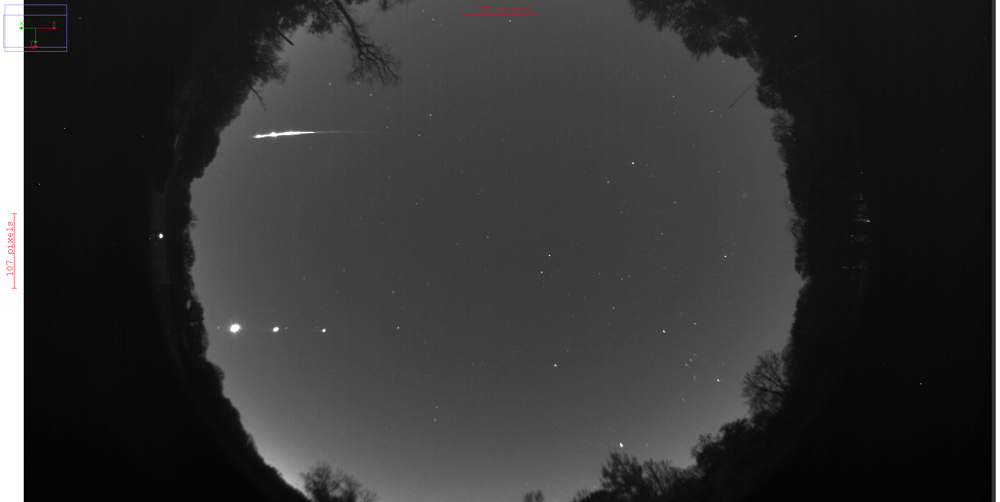

python for an All Sky Camera
============================

This project describes not only the set up of the camera and
associated software on the connected computer, it also helps you set
up a server, and associated python code to perform some image
processing. Lots of example scripts and image inventory logs are kept
here as well.

Our currrent camera in the Maryland All Sky Network (and
the Haiti All Sky Camera, HASC, as well) is an Oculus all sky camera from
Starlight Xpress
(http://www.sxccd.com/oculus-all-sky-camera; available in the US through http://www.optcorp.com/starlight-xpress-oculus-all-sky-camera.html). Most
of our cameras use the 180 degree lens, though we have one  150 degree lens to
experiment with the finer resolution. FITS images are
1392 x 1040 in size, where the full sky (180 or 150 degrees) covers
1040 pixels.

Frame 1329 from 20151108 (8-nov-2015) showing 3 planets, the moon and a meteor.
