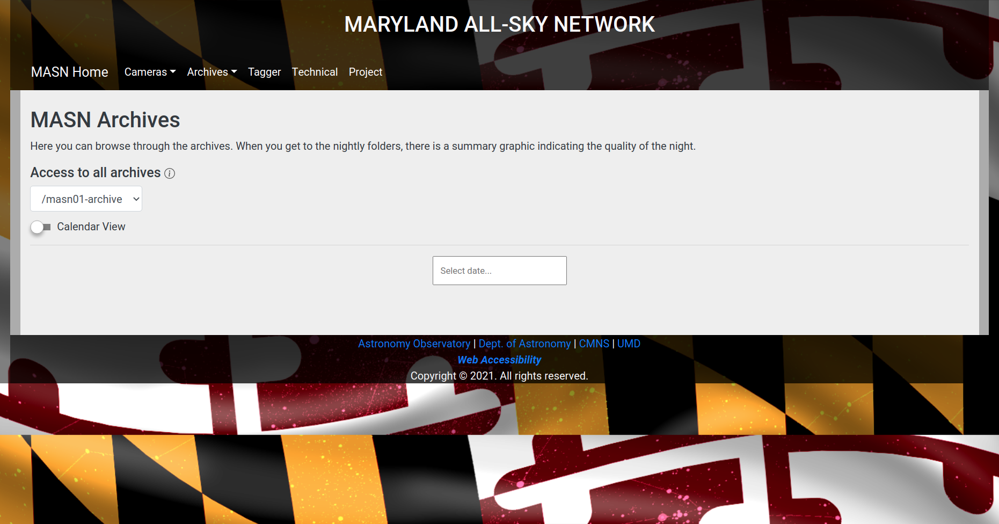
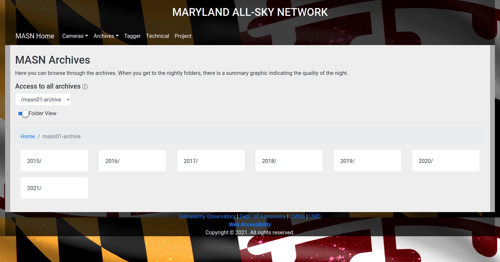
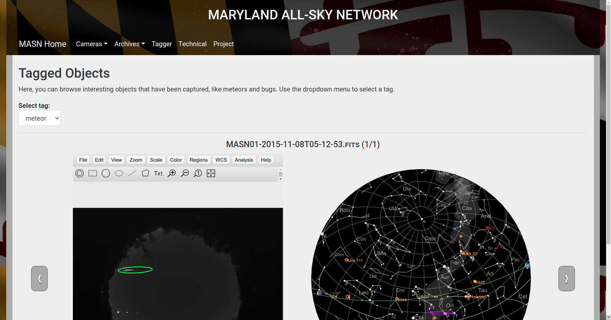
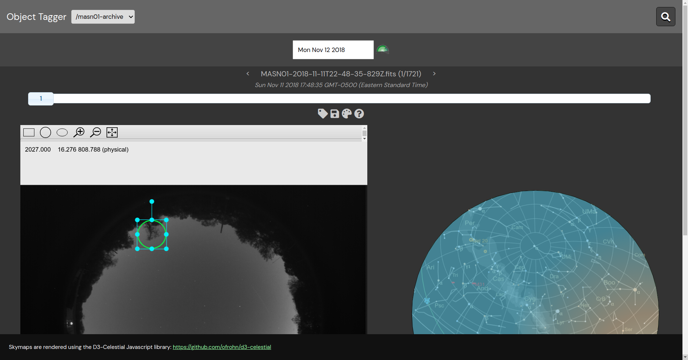

# Project Site

This is the webtree as you should find it on http://mdallsky.astro.umd.edu/

This is located on `luna.astro.umd.edu:/n/www/mdallsky`, so do not edit files
if you are not in a managed git tree. Or run the risk at an update they will
be overwritten.
We now maintain a script `mdallsky_update` which should maintain updates and
contains info on the current configuration if it would be updated in the future.

The http server (since 2020) uses `luna:/etc/httpd/sites.d/mdallsky.conf`


The way the tree is structured, it assumes the docroot to be the root of this directory,
so it's currently not easy to get the full experience if you view it "locally". This
is because we assume it's on the docroot of http://mdallsky.astro.umd.edu/

## Features

The site currently offers several features to allow public viewing of data from the camera, including tagged images with regions of interest. It also features an administration tool to manage these tags and regions of interest, which may be used by anyone with the correct credentials.

### Camera Archives

This utility lets public viewers access all camera data and view it in-browser using the JS9 FITS viewer. Data may be selected using either a folder or calendar-based interface.



### Tagged Objects

This utility lets public viewers see specific regions that have been tagged. Example regions might be meteors, planes, or bugs.



### Object Tagger

This utility lets given users create, view, and modify tagged regions of interest.



## Setup

### Prerequisites

The site relies on the following software:

- Apache 2
- Apache 2 AuthGroupFile module
- SQLite3
- PHP >= 5.4
- Corresponding PHP plugin for SQLite3

### Additional Steps

#### Allowing Indexing

It is required that directory indexing is allowed within the `www/` tree. Configuration may vary depending on your specific server setup, but most implementations of this step will involve modifying `apache2.conf` in the following fashion:

    <Directory /var/www/>
	Options Indexes FollowSymLinks
	AllowOverride None
	Require all granted
    </Directory>

    <Directory /var/www/html>
        Options Indexes FollowSymLinks
        AllowOverride All
    </Directory>

In the above configuration, the `FollowSymLinks` configuration is also set, which may be useful if you also intend to symlink data directories into the site.

#### Data Directories and .gitignore

It is recommended that you add any data directories to the `.gitignore` file for this repository to avoid committing large blobs of binary data.

#### Password Protection and .htaccess

After installing the above, you will also need to create a password file for the `.htaccess` file, and change it accordingly:

    AuthUserFile <file>
    AuthGroupFile /dev/null
    AuthName "MASN Object Tagger"
    AuthType Basic
    require valid-user <username>

Without this, users will not be able to access the password-protected portions of the site.

An example `.htaccess` file could look like:

```htaccess
AuthUserFile /an/terra_a/cooldude/protectthese/.mypasswordfile
AuthGroupFile /dev/null
AuthName "MASN Object Tagger"
AuthType Basic
require valid-user allsky1
```

## File Structure

### Data Directories

Data directories are the directories that contain the images from a camera. They are always expected to be in the `www/` directory, e.g. `www/masn01-archive`, `www/masn02-archive`, etc.

### Name Schema

Individual FITS files are assumed to be named in the following format:

    <CAMERA>-<YYYY>-<MM>-<DD>T<HH>-<MM>-<SS>-<sss>Z.fits

The format is meant to provide information about the source camera and
observation time for a given file. For example,
`MASN01-2018-11-01T09-48-26-416Z.fits` fits this format, and shows
that the file was taken by the MASN01 camera at Thu Nov 01 2018
05:48:26 GMT-0400 (Eastern Daylight Time). 

qNote that the times in the filenames are given in UTC time, as indicated by the `Z` suffix.

Note that we don't exactly follow the ISO date+time convention, the (:) separator
beween HH, MM, SS and sss is now a dash (-).


### Directory Tree

The site assumes a specific directory tree structure in each data directory. Namely, given a data directory, the site expects that files are stored in the following manner:

    directory/
    ├─ yyyy/
    │  ├─ yyyy-mm/
    │  │  ├─ yyyy-mm-dd/
    │  │  │  ├─ (fits files following the naming scheme)
    │  │  │  ├─ sky.tab
    │  │  │  ├─ sky.tab.png
    │  │  │  ├─ sky.tab.thumb.png


Here is part of an example directory tree from `masn01-archive/`:

    directory/
    ├─ 2016/
    │  ├─ 2016-01/
    │  │  ├─ 2016-01-01/
    │  │  │  ├─ (fits files following the naming scheme)
    │  │  │  ├─ sky.tab
    │  │  │  ├─ sky.tab.png
    │  │  │  ├─ sky.tab.thumb.png
    |  |  ├─ 2016-01-02/
    |  |  |  ├─ ...
    │  ├─ 2016-02/
    │  │  ├─ ...
    ├─ 2017/
    |  ├─ ...

Note the `sky.tab` files, which are explained in the following section.

### Skytabs


Skytabs are small images that may summarize the quality of an observing, or anything other aspect of a folder. They will be rendered in the folder view as long as they are stored as `sky.tab.png`, `sky.tab.thumb.png`, and `sky.tab`, which are the high resolution, low resolution, and textual data respectively.

## Configuration

There are several configuration options available in `config.json`. By default, this configuration is:

```json
{
    "default-data": "masn01-archive",
    "directory-regex": "masn.+archive",
    "image-tags": ["meteor", "plane", "bug", "satellite", "misc"]
}
```

The options are:

|      Option     |                                                     Description                                                    |                     Default                     | Example                                     |
|:---------------:|:------------------------------------------------------------------------------------------------------------------:|:-----------------------------------------------:|---------------------------------------------|
|   default-data  |    The default data directory. The site will look here first when listing files in the viewer and object tagger.   |                 "masn01-archive"                | "masn02-archive"                            |
| directory-regex |      The regular expression used to automatically detect other data directories in the www/ tree. PCRE style.      |                 "masn.+archive"                 | ".+archives"                                |
|    image-tags   | The set of tags that may be used to tag regions of interest. Used in the object tagger and tagged objects gallery. | ["meteor", "plane", "bug", "satellite", "misc"] | ["ufo", "alien", "angel", "ball lightning"] |

## Browser Compatibility

The site is designed to run in browsers that support HTML5 and CSS3.


## Generating new thumbnails

The **sky.tab** files and thumbnails are computed by a python script, which also generates the graphics 
described above.   Here is an example to update a new month of data that has been archives, and add
these. They will automatically be picked up by the current software.

	  # change directory to one of the new months, e.g.
	  # within which you should directories with the name yyyy-mm-dd
	  
	  cd /n/alberio10nb/data/ASC/MASN-01/archive/2021-08
	  
	  # set group permissions
	  
	  umask 2
	  chgrp -R allsky .
	  chmod g+s allsky .

	  
	  # run the script
	  
	  find . -type d -exec /n/astromake/opt/allsky/pyASC/ASC/SkyThumbs.csh '{}' \;
	  
	  # you will now see a bit of progress reporting for each yyyy-mm-dd day
	  # taking around 2 minutes per day per 1000 images.
	  
	  # ensure the permissions are correct
	  chmod g+s ASC -R

	  
In case of confusion, this documentation is also maintained in the **SkyThumbs.csh** 
script. As time evolves, location and python definitions may change!
